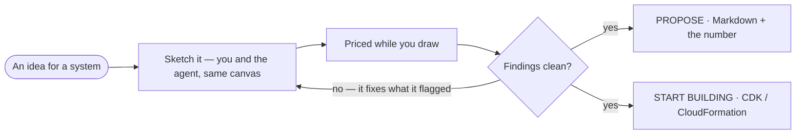
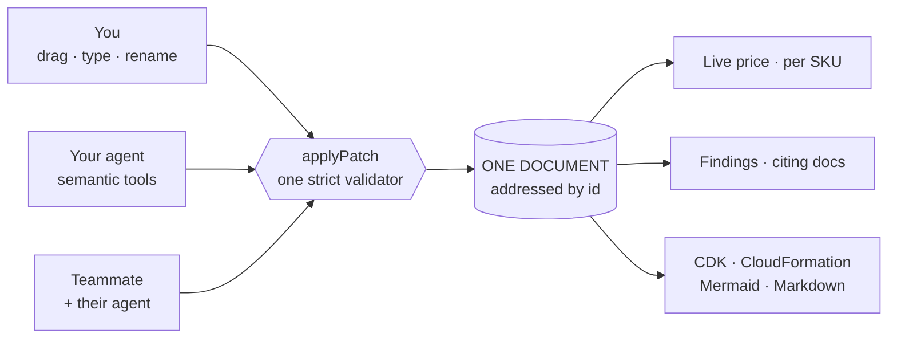

# Devpost · copy-paste ready

*WebMCP is the star. Don't name competitors. Verify the tool count before submitting (note at the end).*
*Three spots marked `[YOU]` need a detail only you have — they're what make this read like a person.*

---

## Project name

```
Overhead
```

## Elevator pitch

```
A web-native canvas powered by WebMCP that turns any agent into a cloud architect. Design alongside it live while it calculates real-time infrastructure costs.
```

---

## Inspiration

I wanted zero friction between proposing an architecture and actually starting one.

Canvas and whiteboard tools make agents work from stale copies. You move a box, the agent redraws from
whatever it remembered, and your change is gone. `[YOU: name the tool, and roughly when this was —
"back in July, wiring up a client's ingest pipeline in <tool>" beats any sentence I can write here]`

Then the rest of it. One app for the costing. Another for the components. Save in whatever format the
next app will actually open. Imagine spending 8+ hours of work to finish a technical documentation that
*nobody reads*.

**Overhead uses WebMCP to eliminate this entirely.** Semantic tools go straight to whatever agent shows
up in the visitor's browser tab, so the design, the number and the code stop being five separate things.



## What it does

Overhead is one web page where you, your agent and your teammates design an architecture that prices
itself, audits itself, and compiles.

- **Deep WebMCP integration.** Agents get structural verbs (`add_service`, `connect`, `patch_state`) and
  edit the canvas directly, with no coordinate math burning tokens. Open a scenario and four more tools
  register themselves under an `AbortController`, then abort on commit.
- **Real prices, per SKU**, generated from the AWS Price List Bulk API with every rate keeping its source
  URL. No number on screen is one we typed.
- **It audits its own work.** The agent checks the design against rules citing cloud documentation, then
  patches what it flagged.
- **Zero-setup multiplayer.** Ephemeral rooms. Several designers, their agents, one document object.
- **Production code compilation.** Layouts compile to infrastructure code that passes `cdk synth`, plus
  deployable CloudFormation and diagrams that go both ways, which matters more than it sounds like it
  does: a Mermaid flowchart pasted out of anyone's README comes back as a priced, editable drawing.

Everything runs client-side. No login, no API keys, no enterprise middleware.



## How we built it

**Stack**

- WebMCP (native agent runtime)
- Next.js 15
- React 19
- React Flow (canvas UI)
- Zustand (state layer)
- Hosted on **Vercel**

The core decision was addressing state patches by **id** rather than array index. Canvas mouse input,
agent tool calls and peer messages all go through one strict `applyPatch` validator, and because every
patch names what it touches instead of where it sits, the agent can't clobber a change you made while it
was mid-thought. That was chosen for the agent's benefit. It turned out to be the reason two people can
edit at once, which we didn't plan for and got almost free.

`defineService()` does the rest. One definition per service produces the inspector form, the tool
schemas, the pricing calculation and the infrastructure exports, so what the human sees and what the
agent gets can't drift apart.

No central database. Browser state only, with a WebSocket relay that routes multiplayer traffic and keeps
none of it.

## Challenges we ran into

**Normalising the price APIs.** Regional string variations, inconsistent schemas, offer codes that don't
match the service name. Every mismatch surfaced as a wrong number on the canvas, which is a miserable way
to find a bug and a very effective one.

**The ~1.5K character cap on tool output.** Tight, and it forced us to send condensed diffs instead of
dumping canvas state. Better tools came out of the constraint.

**Mixing grammars.** A decision diamond sitting next to a Lambda asserts two incompatible things at once:
architecture says what exists, a flowchart says what happens in what order. We let the samples teach the
split instead of having the validator forbid it.

## Accomplishments that we're proud of

- The agent audits its own work. Ask it to build something, then ask it to check what it built, and it
  calls `get_findings`, gets back rules citing AWS docs, and fixes them. That loop only exists because
  the tools are semantic.
- Dynamic registration you can watch happen. The tool count ticking up when a scenario opens, and back
  down on commit, is WebMCP doing something a screenshot can't fake.
- `npm run synth` runs `cdk synth` on all three samples plus a fixture holding one node of every service.
  So the claim we make on camera is checked by a command.
- CloudFormation round-trips. A template we wrote comes back as the same drawing, positions and
  containers and traffic intact, because the exporter also writes the things a template has no place for.
  Someone else's template comes back structurally, connections inferred from what references what.
- Never a hardcoded price. Every rate traces to a SKU in a dated file with a source URL.
- One document, three writers: canvas, code panel, agent. A mistake typed into the JSON gets the same
  error an agent gets from `set_property`.

## What we learned

**Semantic tools beat drawing primitives, and it is not close.** Give an agent services and settings and
it can be trusted with the next step, because its answers can be wrong in ways you can review and audit.
Handing it long lists of SVG, or rules for making a diagram look right, is strictly worse.

**Constraints improved the surface.** The output cap forced summaries instead of state dumps. Keeping
state out of a server forced everything into the page, which is exactly what makes it work for a
visitor with no account · the one server route is a relay that stores nothing, and the design would
be the same without it.

**WebMCP changes who gets to offer capability.** Before it, you needed to be a platform big enough to
ship an API and run an official MCP server. Now any page can serve whatever agent the visitor brought. No
partnership, no permission, no server.

**Measure what you claim.** "Fewer crossing edges" and "the CDK works" are both testable. Both were wrong
at some point, in ways that looked completely fine on screen.

## What's next for Overhead

1. **Resource identity that survives a repo.** Right now a foreign template matches back by service and
   name. Stamping the logical id onto the node would make a second import an update instead of a new
   drawing, even after a rename.
2. **Generate the wiring.** The CloudFormation export names its stubs honestly: permissions, event
   sources and targets aren't generated yet. The edges already know what should be wired to what.
3. **"Visualise my architecture."** The real destination. A coding agent has your repo, the page has the
   tools, and the diagram appears priced with no export step and no file to hand over. A crude version of
   this works today.
4. **More services as their SKUs land:** NAT Gateway, ALB, RDS, ECS Fargate. The rule doesn't bend. Never
   hardcode a price, and a service arrives when its rate does.

---

### ⚠ Before you paste this in

**Three `[YOU]` gaps to fill.** They're in Inspiration. The tool that overwrote your edits, roughly when,
and what you were building at the time. Specificity is the thing no model produces, and Devpost's own
guidance says judges can tell.

**The tool count is settled: 39 → 43.** That's what the live pill reads, and the live UI beats my count
from the source. Fixed here, in SCRIPT.md and in the README. If you add or remove a tool before you
record, re-read the pill and update all three again.

**Two claims I softened, so they'd survive a judge reading the repo.** "P2P rooms" became "ephemeral
rooms", because `app/api/room/route.ts` is a relay, not peer-to-peer. And "live price feeds" became
"generated from", because `fetch-pricing.ts` runs at build time and the page makes no runtime pricing
call. The provenance story is strong without the word "live."
