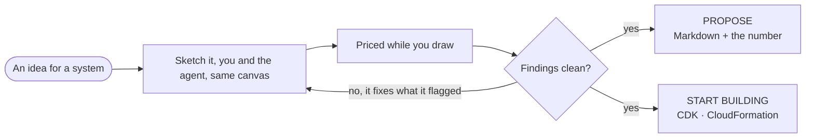
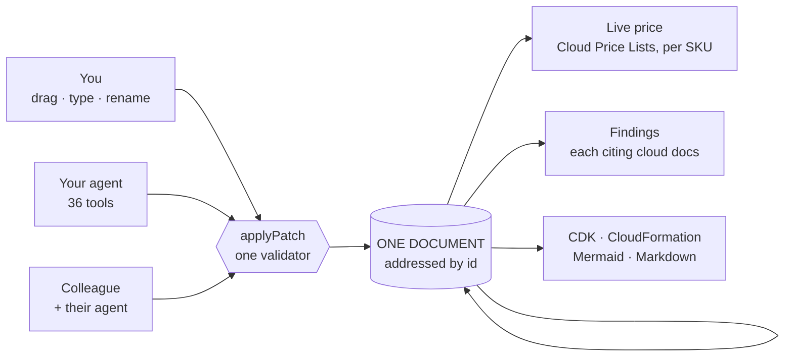

# Devpost Submission

## Project name

```text
Overhead
```

## Elevator pitch

```text
A web-native canvas powered by WebMCP that turns any agent into a cloud architect. Design alongside it live while it calculates real-time infrastructure costs.
```

## Inspiration

I wanted zero friction between proposing an architecture and starting it.

Traditional whiteboard tools force agents to work from stale local copies that constantly overwrite your manual canvas edits. **Overhead uses WebMCP to eliminate this entirely**, handing semantic tools directly to whatever agent shows up in the visitor's browser tab to solve real-world, friction-heavy cloud design silos.



## What it does

**Overhead delivers a complete, cohesive, and production-ready product experience rather than a basic proof-of-concept.**

- **🎯 Deep WebMCP Integration (36 Tools):** Gives any incoming agent a direct, granular vocabulary (`add_service`, `patch_state`) to manipulate the live canvas architecture directly from the browser tab.
- **🚀 Dynamic Capability Scaling (36 → 40 Tools):** Opening specific engineering scenarios instantly registers 4 new lifecycle tools under a runtime `AbortController`, proving a highly non-trivial WebMCP implementation.
- **📈 Real-Time Cost Engineering:** Fetches itemized cloud resource costs per SKU directly from live Bulk Price List APIs with zero hardcoded metrics, grounding designs in real economic context.
- **🛡️ Automated Agent Self-Audits:** The agent continuously audits its own canvas work against cloud documentation rules, flags financial optimizations, and dynamically patches its own mistakes.
- **🧠 Bi-Directional Visual Ingestion:** Converts pasted Mermaid flowchart scripts instantly into live, priced service nodes on the canvas, bridging text and visual layout paradigms.
- **👥 Zero-Configuration Multiplayer Engine:** Activating Live creates an instant P2P room where multiple human engineers and their respective local agents seamlessly edit the exact same document.

Every single capability runs client-side directly in the visitor's web tab with no login, no API keys, and no heavy enterprise middleware.



## How we built it

- **💡 THE CORE TECH STACK:** **WebMCP** (native agent runtime) · **Next.js 15** · **React 19** · **React Flow** (canvas UI) · **Zustand** (state layer) · Hosted on **Vercel**.
- **🛠️ Non-Trivial State Architecture:** Built an ID-based state patching engine where canvas mouse inputs, WebMCP agent tools, and peer messages pass through a single, strict, unified `applyPatch` validator.
- **💎 Single Source of Truth:** A unified `defineService()` structure drives inspector forms, tool schemas, pricing calculations, and infrastructure exports natively so human and agent logic can never drift.
- **⚡ Decentralized Execution:** The entire system relies on local browser state with zero central database footprint, utilizing a minor 40-line WebSocket relay solely for ephemeral multiplayer routing.

## Challenges we ran into

- **Normalizing Non-Uniform Price APIs:** Overcoming massive regional string variations and chaotic cloud pricing schemas required aggressive data engineering to keep canvas outputs exact.
- **1.5K Character Tool Output Limits:** Tight token window constraints forced the engineering of highly condensed string updates rather than dumping raw, heavy canvas state payloads.

## Accomplishments that we're proud of

- **✨ Deep Creative Ambition:** Proved that a human designer and an automated agent can modify a single canvas object simultaneously over a wire format without fighting for control.
- **📦 Production-Ready Exports:** Every single sample automatically passes local `cdk synth` validation, compiling visual layouts straight into deployable, enterprise-grade cloud code.
- **🔧 State-Driven Tool Injection:** Successfully demonstrating dynamic WebMCP capabilities modifying themselves live in the UI based entirely on active canvas states.

## What we learned

- **WebMCP Shifts the Paradigm:** Traditional AI design platforms require heavy server architectures; Overhead proves a client-side webpage can serve as a robust, secure, custom agent runtime.
- **Semantic Meaning Over Raw Shapes:** Passing structured service strings yields vastly deeper AI reasoning and consumes less token bandwidth than coordinate-heavy SVGs.

## What's next for Overhead

- **Expanding Vocabularies:** Deploying simple schema definition files to automatically unlock sequence diagrams, organizational charts, and deep network topologies for the agent.
- **CRDT Syncing:** Transitioning the current last-writer-wins multiplayer engine into true conflict-free replicated data types using Yjs.
